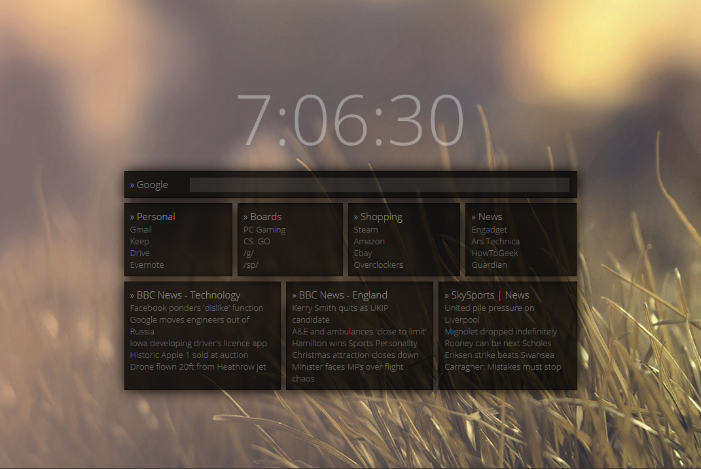

<h1 align="center">Startpage</h1>

    A modern way to start your web browsing
     

A minimal, Material Design inspired browser home/new tab page designed to act as a personal dashboard.

**Features**
* Night and Day Material Design themes, which switch automatically (between 5PM and 6AM)
* Panels for user links and RSS feeds (customization coming soon™)
* Easy access search engine input (customization coming soon™)
* Floating Action Button which provides access to options and a settings menu

**Resources Used**
* Skeleton - [GitHub Repo](https://github.com/dhg/Skeleton)

## Preview
Current build (12/08/15):

